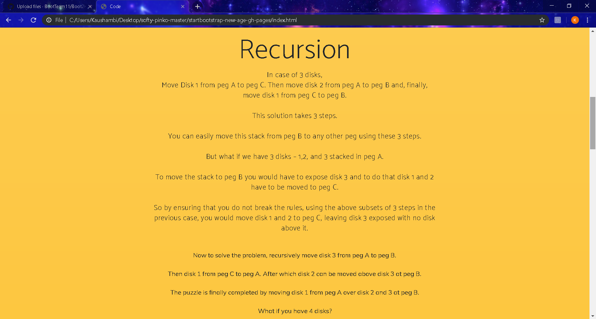

# PROCEDURE
**STEP 1**:-
## First of all open a Tower of Hanoi.html

**STEP 2** : 
## Read the history and Instructons to play the games.

**STEP 3** : - 
## The student is suppossed to visit "Game Play of 3 Disks"

**STEP 3 a.** :  
## The student is suppossed to play the game with 3 Disks. 

**STEP 3 b**:- 
## The student can proceed using Play with 7 disks button after solving the Puzzle based on his choice.

**STEP 4** :- 
##

**STEP 4a** :-

(i) The student is suppossed to play the game with 7 Disks.
## 

(ii)
## The student can proceed to Code part after solving the Puzzle based on his choice.

**STEP 5**:-
## Proceed to 'Test Yourself'.

**STEP 6**:-
## Now attempt the quiz of 10 question every question is of 1 mark

**STEP 7** :- 
## At the end Result is shown.

# EXPERIMENT COMPLETED
